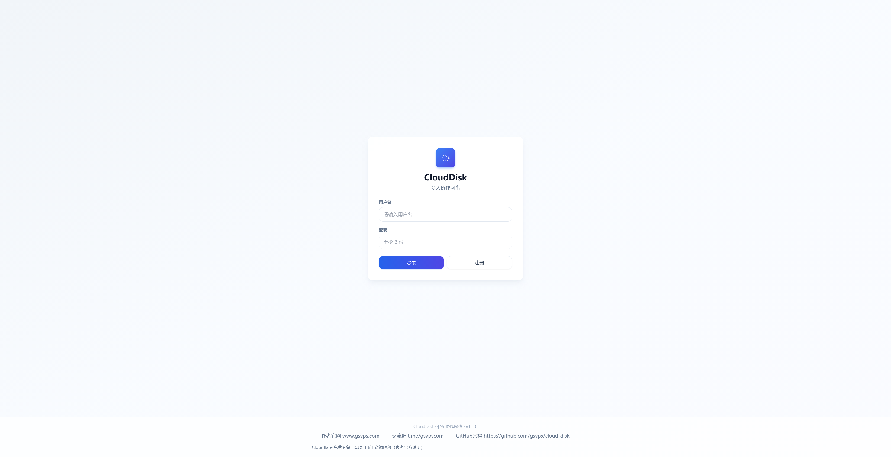
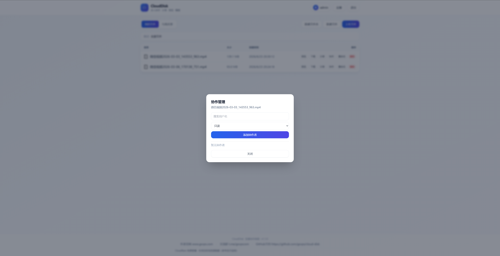
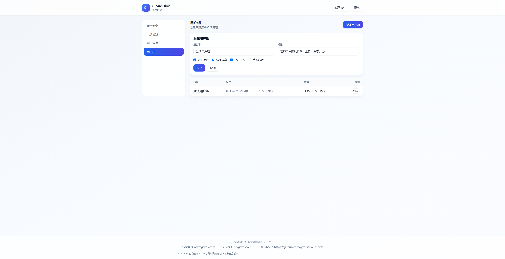
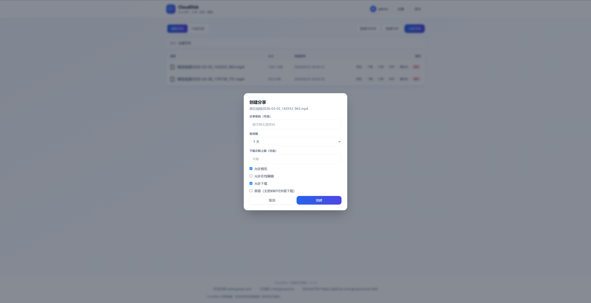

# CloudDisk

**Current version: v1.2.0** · [Changelog](CHANGELOG.md) · **中文:** [README.md](README.md)

A lightweight personal cloud drive on Cloudflare Workers. **Cloudflare deployment only** — free tier friendly, no VPS, no MySQL.

## Screenshots

| Login / Register | File list |
| :---: | :---: |
|  |  |

| User groups | Create share |
| :---: | :---: |
|  |  |

## Release notes

### v1.2.0

- Upload progress and resumable multipart uploads (≥ 5 MB)
- Toast notifications for API errors and operation results
- Footer with Cloudflare free-tier limits, author site, and community links

### v1.1.0

- Preview/edit permission rules, preview link copy, new file/folder modals
- Admin settings, user groups, version in footer

See [CHANGELOG.md](CHANGELOG.md) for full history.

## Features

CloudDisk fits individuals and small teams running on Cloudflare’s free plan: files in **R2**, metadata in **D1**, sessions in **KV** — fully serverless.

### Files & folders

- Browse folders; create folders and files with **any extension** (e.g. `.md`, `.py`, `.json`)
- Upload, download, delete, rename; drag-and-drop upload with **progress**
- Large files (≥ 5 MB): **multipart upload** with resume (re-select the same file to continue)

### Collaboration & permissions

- Multi-user login; admin can toggle registration and manage users/groups
- Add collaborators to files or folders: **read-only** or **can edit**
- Username **autocomplete** when adding collaborators; dedicated “Shared with me” view
- User groups control upload, share, collaborate, and admin permissions

### Sharing

- Public links: optional password, expiry, download limit
- **Folder sharing** (browse, preview, download)
- Optional direct link, online preview, and guest editing (by file type and share settings)

### Preview & edit

- Preview images, PDF, audio/video, text, and **Office** (Word / Excel / PPT, etc.)
- Preview page shows the **full URL** with one-click copy
- Text files (≤ 2 MB) editable online; non-editable types hide the edit action
- Collaborators and share visitors follow the same read/edit rules

### UX & admin

- Full-screen preview/edit; **toast** feedback for success, failure, and API errors
- Settings: change password, registration toggle, user/group management (admin)
- Footer documents **Cloudflare free-tier** limits (Workers / D1 / R2 / KV)

> **Upgrading an existing deployment:** run D1 migrations after redeploy — `npm run db:migrate` (included in the default deploy script).

## Tech stack

- [Cloudflare Workers](https://developers.cloudflare.com/workers/) + [Hono](https://hono.dev/)
- [Cloudflare D1](https://developers.cloudflare.com/d1/) (metadata) + [R2](https://developers.cloudflare.com/r2/) (files) + [KV](https://developers.cloudflare.com/kv/) (sessions)
- [Drizzle ORM](https://orm.drizzle.team/) + [TypeScript](https://www.typescriptlang.org/) + [Tailwind CSS](https://tailwindcss.com/)

## Deploy to Cloudflare

[](https://deploy.workers.cloudflare.com/?url=https://github.com/gsvps/cloud-disk/tree/main)

> In **Configure resources**, confirm: **D1** = `cloud-disk`, **KV** = `cloud-disk`, **R2** = `cloud-disk-files`. Leave **project name / Worker name / `APP_NAME`** empty unless you want custom values (default app title is `CloudDisk`).

> **“Repository with this name already exists”**  
> One-click deploy forks into your GitHub account. Pick a new repo name (e.g. `my-cloud-disk`), or connect an existing repo via the Cloudflare Dashboard (below).

> **Deploy without forking**  
> In [Cloudflare Dashboard](https://dash.cloudflare.com/) → **Workers & Pages** → **Create** → connect `gsvps/cloud-disk` and deploy using `wrangler.toml`.

Cloudflare reads `wrangler.toml` and provisions D1, KV, and R2. Default names:

| Resource | Default name | Notes |
|----------|--------------|--------|
| Project / Worker name | **empty (you choose)** | Not preset in repo |
| `APP_NAME` | **empty (optional)** | UI defaults to `CloudDisk` |
| D1 | `cloud-disk` | User & file metadata |
| KV | `cloud-disk` | Sessions (same name as D1, different resource) |
| R2 | `cloud-disk-files` | Uploaded files |

First visit prompts you to create an admin account.

### Advanced settings (defaults)

| Setting | Default | Source |
|---------|---------|--------|
| Build | `npm run build` | `package.json` |
| Deploy | `npm run deploy` | `package.json` |
| Node.js | `22` | `.nvmrc` |
| Branch | `main` | repo default |
| D1 / KV / R2 | see table above | `wrangler.toml` / deploy UI |

### Manual deploy

```bash
git clone https://github.com/gsvps/cloud-disk.git
cd cloud-disk
npm install
npx wrangler login
npm run build
npm run db:migrate
npx wrangler deploy --name cloud-disk
```

Optional resource creation:

```bash
npx wrangler d1 create cloud-disk
npx wrangler kv namespace create cloud-disk
npx wrangler r2 bucket create cloud-disk-files
```

## API

Success:

```json
{ "success": true, "data": {} }
```

Error:

```json
{ "success": false, "error": { "code": "BAD_REQUEST", "message": "..." } }
```

See Chinese [README.md](README.md) for the full endpoint table.

## Author & community

- Website: [https://www.gsvps.com](https://www.gsvps.com)
- Telegram: [https://t.me/gsvpscom](https://t.me/gsvpscom)

## License

[MIT License](LICENSE)
